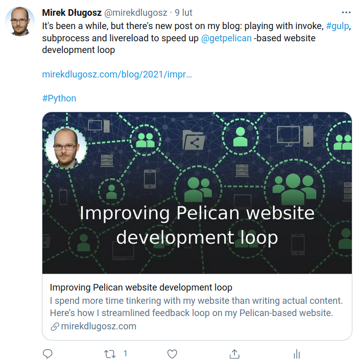
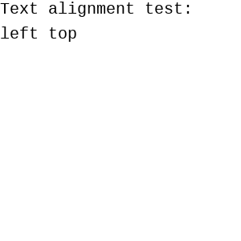
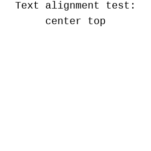
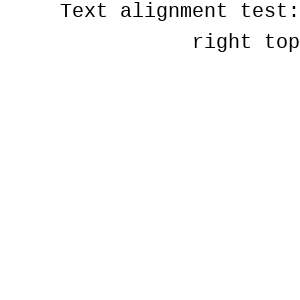
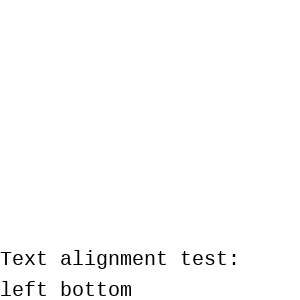
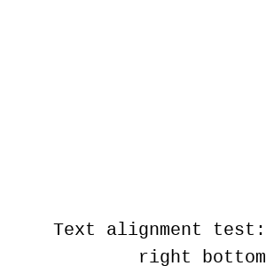

# Generate social media cards: A Plugin for Pelican

[](https://github.com/mirekdlugosz/pelican-social-cards/actions) [](https://pypi.org/project/pelican-social-cards/)

This plugin generates images with your article titles embedded on them. These images can then be used as "card" metadata and appear on social media when your post is shared, making these posts more visually appealing. The final effect might look something like this:

|  |
|---|

Path to generated image is added to each article / page in `og_image` attribute, so it's easy to use in theme.

Do note that plugin **only** generates images - you must reference them in your output HTML for social media platforms to pick them up. There are themes and plugins that can help with that part. See "[Referencing file in output HTML](#referencing-file-in-output-html)" for brief overview of required changes and available options.

* [Generate social media cards: A Plugin for Pelican](#generate-social-media-cards-a-plugin-for-pelican)
* [Installation](#installation)
* [Usage](#usage)
    * [Initial configuration](#initial-configuration)
    * [Preparing template file](#preparing-template-file)
    * [Tweaking card visuals](#tweaking-card-visuals)
        * [Font](#font)
        * [Line length](#line-length)
        * [Text placement and alignment](#text-placement-and-alignment)
    * [Controlling text on the card](#controlling-text-on-the-card)
    * [Referencing file in output HTML](#referencing-file-in-output-html)
    * [Iterating on card design](#iterating-on-card-design)
* [Configuration options](#configuration-options)
    * [`SOCIAL_CARDS_TEMPLATE`](#social_cards_template)
    * [`SOCIAL_CARDS_PATH`](#social_cards_path)
    * [`SOCIAL_CARDS_FORMAT_EXTENSION`](#social_cards_format_extension)
    * [`SOCIAL_CARDS_FONT_FILENAME`](#social_cards_font_filename)
    * [`SOCIAL_CARDS_FONT_SIZE`](#social_cards_font_size)
    * [`SOCIAL_CARDS_FONT_FILL`](#social_cards_font_fill)
    * [`SOCIAL_CARDS_FONT_OUTLINE_SIZE`](#social_cards_font_outline_size)
    * [`SOCIAL_CARDS_FONT_OUTLINE_FILL`](#social_cards_font_outline_fill)
    * [`SOCIAL_CARDS_CANVAS_WIDTH`](#social_cards_canvas_width)
    * [`SOCIAL_CARDS_CANVAS_HEIGHT`](#social_cards_canvas_height)
    * [`SOCIAL_CARDS_CANVAS_LEFT`](#social_cards_canvas_left)
    * [`SOCIAL_CARDS_CANVAS_TOP`](#social_cards_canvas_top)
    * [`SOCIAL_CARDS_HORIZONTAL_ALIGNMENT`](#social_cards_horizontal_alignment)
    * [`SOCIAL_CARDS_VERTICAL_ALIGNMENT`](#social_cards_vertical_alignment)
    * [`SOCIAL_CARDS_LEADING`](#social_cards_leading)
    * [`SOCIAL_CARDS_WRAPPING_FUNCTION`](#social_cards_wrapping_function)
    * [`SOCIAL_CARDS_CHARS_PER_LINE`](#social_cards_chars_per_line)
    * [`SOCIAL_CARDS_KEY_NAME`](#social_cards_key_name)
    * [`SOCIAL_CARDS_INCLUDE_SITEURL`](#social_cards_include_siteurl)
    * [`SOCIAL_CARDS_INCLUDE_DRAFTS`](#social_cards_include_drafts)
    * [`SOCIAL_CARDS_INCLUDE_HIDDEN`](#social_cards_include_hidden)
    * [`SOCIAL_CARDS_FORCE_SAVE`](#social_cards_force_save)
* [Contributing](#contributing)

# Installation

Plugin can be installed from PyPI:

```shell
pip install pelican-social-cards
```

# Usage

## Initial configuration

First, you need an image that will serve as template. For each article, plugin will copy this file and draw text on it. Specify location of this file with `SOCIAL_CARDS_TEMPLATE` setting:

```
SOCIAL_CARDS_TEMPLATE = "content/misc/card-template.png"
```

Files will be created in `social-cards` subdirectory of your Pelican content directory (you can change this using `SOCIAL_CARDS_PATH` setting). You should add that directory to your `STATIC_PATHS`, so Pelican can find these images and copy them to output directory.

```
STATIC_PATHS = ['social-cards']
```

That's it! If you build your website now, it will take much longer than usual, as plugin is busy creating all the cards for you. Then, you can see your cards in `content/social-cards/` and `output/static/social-cards/`. Don't worry - next build will be about as quick as it has always been, as plugin will not re-create already existing images.

If you keep your website in git version control system, you probably want to add `social-cards/` to your `.gitignore` file.

Read "[Tweaking card visuals](#tweaking-card-visuals)" for brief overview of settings that you probably want to change, and "[Configuration options](#configuration-options)" for list of all available settings.

## Preparing template file

Each social media platform has their own requirements towards images associated with shared link. One common element is that card image dimensions should maintain 1.91:1 ratio, or at least approach it. Twitter will accept images as small as 144 x 144 px; Facebook accepts images that are at least 200 x 200 px, but recommends at least 600 x 315 px; LinkedIn expects images to be at least 1200 x 627 px.

Overall, **1200 x 630 px** is good default size of template image. However, plugin will not enforce any rules on your template, so feel free to use any size you want.

What template file represents (how it looks) is entirely up to you. Most social media experts would recommend cards to maintain some relation to visuals of your site. Keeping the same background color and putting your logo / site name somewhere are good starting points. Obviously, you need to leave some empty space, so text doesn't cover other elements of your image.

Template file must be in a format that can be read by [Pillow](https://python-pillow.org/). JPEG and PNG are good choices.

Content of `SOCIAL_CARDS_TEMPLATE` setting is passed verbatim to `PIL.Image.open()`, which means that you can keep your template file anywhere in your file system. It is recommended to keep it with website sources, probably somewhere in `content` or `theme` directory.

## Tweaking card visuals

### Font

`SOCIAL_CARDS_FONT_FILENAME` specifies font that will be used. Value of this setting is passed verbatim to [`PIL.ImageFont.truetype()`](https://pillow.readthedocs.io/en/stable/reference/ImageFont.html#PIL.ImageFont.truetype), so all of this function limitations and requirements apply. This should be path to TTF file, or just a name of font file - Pillow will try to find it in global operating system fonts storage.

`SOCIAL_CARDS_FONT_SIZE` specifies size of the font, in pixels.

`SOCIAL_CARDS_FONT_FILL` specifies color of text. Value of this setting is passed verbatim to [`PIL.ImageColor`](https://pillow.readthedocs.io/en/stable/reference/ImageColor.html). Pillow supports multiple color formats, but `#rrggbb` or [CSS human-friendly name](https://developer.mozilla.org/en-US/docs/Web/CSS/color_value#color_keywords) are probably easiest to use.

`SOCIAL_CARDS_LEADING` specifies leading, sometimes also called "line spacing" or "interline spacing", that is the distance from the very bottom of one line of text to the very top of next line. In general, larger font sizes require larger leading.

### Line length

`SOCIAL_CARDS_CHARS_PER_LINE` specifies the maximum number of characters in one line. [`textwrap.wrap()`](https://docs.python.org/3/library/textwrap.html#textwrap.wrap) is used under the hood, which tries to break lines on last whitespace character before maximum length. This setting is passed as `width` parameter to the function.

`SOCIAL_CARDS_WRAPPING_FUNCTION` allows you to specify function that will be used instead of `textwrap.wrap`. This setting may be useful if you have very specific text wrapping requirements. See also "[Controlling text on the card](#controlling-text-on-the-card)" below.

### Text placement and alignment

The area of image where text should be drawn is called "canvas". Plugin does not enforce the text to actually fit that area, but it will issue the warning when text turns out to be larger than designated area. If you experience multiple such warnings, perhaps canvas size, font size or number of characters per line should be adjusted. If you experience only few of these warnings, take a look at "[Controlling text on the card](#controlling-text-on-the-card)" below for setting custom text on per-article basis.

`SOCIAL_CARDS_CANVAS_WIDTH` is width of text area, in pixels.

`SOCIAL_CARDS_CANVAS_HEIGHT` is height of text area, in pixels.

`SOCIAL_CARDS_CANVAS_LEFT` is left margin of text area, that is distance from the left border of image to left border of canvas. Plugin will try to not write any text there, but may fail to do so when your text is not left aligned and line width is larger than canvas width.

`SOCIAL_CARDS_CANVAS_TOP` is top margin of text area, that is distance from the top border of image to top border of canvas. Plugin will try to not write any text there, but may fail to do so when your text is not top aligned and total height of text lines is larger than canvas height.

`SOCIAL_CARDS_HORIZONTAL_ALIGNMENT` is alignment of text within canvas. Valid values are `"left"`, `"center"` and `"right"`. See below for visual representation of various settings.

`SOCIAL_CARDS_VERTICAL_ALIGNMENT` is alignment of text within canvas. Valid values are `"top"`, `"center"` and `"bottom"`. See below for visual representation of various settings.

|  |  |  |
|--------------|--------------|--------------|
|  |  |  |
|  |  |  |

## Controlling text on the card

By default, text written on image will be article / page title. However, you can change that on per-article basis by adding `og_image_text` custom metadata to your file header. This may be useful when you want to use shorter version of title on social media card, or when you want finer control on text wrapping without rolling out your own wrapping function.

When plugin encounters `og_image_text` key, the only thing it does is splitting the value on `\n` characters. No further processing of text is done. That means that you can use `\n` to force text to wrap to new line; it also means that if you want typographically correct characters (e.g. `“”` instead of `""`), you must input them yourself.

## Referencing file in output HTML

Apart from creating image to be used as a card on social media, you must also ensure that social media platforms can find your images. For this, you need `og:image` metadata in head section of your output HTML file:

```html
<meta property="og:image" content="URL_OF_IMAGE"/>
```

One way of including this HTML is using theme that is aware of open graph tags. Some themes in [pelican-themes](https://github.com/getpelican/pelican-themes) repository have support for open graph images built in. To find these themes, clone the repository and use command like `grep -l -R 'og:image'`.

Another way is using [pelican-seo](https://github.com/pelican-plugins/seo) plugin. That plugin can be used with any theme, as it modifies generated HTML. Support for open graph tags was added in version 1.1.0. To generate open graph tags, you need to set `SEO_ENHANCER_OPEN_GRAPH` setting to `True` - however, you need to do that in `pelican/plugins/seo/settings.py` file inside your virtual environment.

## Iterating on card design

Generating single image may take up to couple hundred milliseconds, so on large sites (few hundred articles) entire process can easily last few minutes. Obviously you don't want to wait so long when you are still trying to find the best settings for your template. Here are two tips on how to approach this problem.

One thing you can do is to let plugin generate all the images for you, pick up one that you want to work on and remove it from `content/social-cards` directory. The next time you build your website, plugin will skip all the images that already exist and generate one missing card. Then you can see how it looks, remove it, adjust the settings and build the website again. Once you are happy with the results, you would remove all the images and allow plugin to generate them again.

Another option is to use [`ARTICLE_PATHS` Pelican setting](https://docs.getpelican.com/en/latest/settings.html#basic-settings), which is the list of paths to articles (or directories containing articles) that Pelican should generate. You can set this setting to point to single article, and plugin will generate image only for this article. Once you are happy with the results that you get, remove the setting and generate images for all of your articles.

There's also `PAGE_PATHS`, which you can use if your website has more pages than articles.

# Configuration options

## `SOCIAL_CARDS_TEMPLATE`

Path to image that will serve as template for your cards. For each article, plugin will copy this file and draw text on it.

Content of this setting is passed verbatim to `PIL.Image.open()`, so file must exist and be one of the [formats that Pillow can read](https://pillow.readthedocs.io/en/stable/handbook/image-file-formats.html#fully-supported-formats).

This is the only mandatory setting, so leaving it undefined has an effect of disabling the plugin without uninstalling it.

*Default value*: `None`

## `SOCIAL_CARDS_PATH`

Path to directory where card images will be saved, relative to Pelican `PATH` setting. Directory will be created if it doesn't exist.

*Default value*: `"social-cards/"`

## `SOCIAL_CARDS_FORMAT_EXTENSION`

File extension of generated image. Consequently, this also specifies image format, and must be one of the [formats that Pillow can write](https://pillow.readthedocs.io/en/stable/handbook/image-file-formats.html#fully-supported-formats).

Note that while this setting does not have to match format of `SOCIAL_CARDS_TEMPLATE` file, template file must be in the mode supported by the format specified in this setting. Namely, trying to use PNG file with alpha channel as template and JPEG as target format will result in fatal error, as RGBA mode can't be converted to JPEG.

JPEG is generally faster to write, but PNG supports alpha, hence latter is the default.

*Default value*: `"png"`

## `SOCIAL_CARDS_FONT_FILENAME`

Name of font to use. Value of this setting is passed verbatim to [`PIL.ImageFont.truetype()`](https://pillow.readthedocs.io/en/stable/reference/ImageFont.html#PIL.ImageFont.truetype), so all of this function limitations and requirements apply. This should be path to TTF file, or just a name of font file - Pillow will try to find it in global operating system fonts storage.

*Default value*: `"Arial.ttf"`

## `SOCIAL_CARDS_FONT_SIZE`

Size of font, in pixels.

*Default value*: `70`

## `SOCIAL_CARDS_FONT_FILL`

Color of text. Value of this setting is passed verbatim to [`PIL.ImageColor`](https://pillow.readthedocs.io/en/stable/reference/ImageColor.html). Pillow supports multiple color formats, but `#rrggbb` and [CSS human-friendly name](https://developer.mozilla.org/en-US/docs/Web/CSS/color_value#color_keywords) are probably easiest to use.

*Default value*: `"#000000"`

## `SOCIAL_CARDS_FONT_OUTLINE_SIZE`

Width of font outline, in pixels. This effect as also known as "text stroke", and results in text being surrounded by a line of potentially different color (see [example image](tests/img/text_outline.png)). Value of this setting is passed verbatim to Pillow.

Value of `0` results in no outline being drawn.

*Default value*: `0`

## `SOCIAL_CARDS_FONT_OUTLINE_FILL`

Color of font outline. Value of this setting is passed verbatim to [`PIL.ImageColor`](https://pillow.readthedocs.io/en/stable/reference/ImageColor.html). Pillow supports multiple color formats, but `#rrggbb` and [CSS human-friendly name](https://developer.mozilla.org/en-US/docs/Web/CSS/color_value#color_keywords) are probably easiest to use.

This setting only takes effect when `SOCIAL_CARDS_FONT_OUTLINE_SIZE` is set to a positive integer.

*Default value*: `"#000000"`

## `SOCIAL_CARDS_CANVAS_WIDTH`

Width of "canvas" in pixels. Canvas is special area where text will be drawn. Depending on font style, font size and number of characters in the line, text may actually be drawn outside of this area - but plugin will issue a warning in this case.

*Default value*: `1200`

## `SOCIAL_CARDS_CANVAS_HEIGHT`

Height of "canvas" in pixels. Canvas is special area where text will be drawn. Depending on font size, leading and number of lines, text may actually be drawn outside of this area - but plugin will issue a warning in this case.

*Default value*: `630`

## `SOCIAL_CARDS_CANVAS_LEFT`

Distance from the left border of image to left border of canvas (left margin of canvas). Plugin will try to not write any text there, but may fail to do so when your text is not left aligned and line width is larger than canvas width.

*Default value*: `0`

## `SOCIAL_CARDS_CANVAS_TOP`

Distance from the top border of image to top border of canvas (top margin of canvas). Plugin will try to not write any text there, but may fail to do so when your text is not top aligned and total height of text lines is larger than canvas height.

*Default value*: `0`

## `SOCIAL_CARDS_HORIZONTAL_ALIGNMENT`

Alignment of text within canvas. Valid values are `"left"`, `"center"` and `"right"`. See "[Text placement and alignment](#text-placement-and-alignment)" above for visual representation of various settings.

*Default value*: `"center"`

## `SOCIAL_CARDS_VERTICAL_ALIGNMENT`

Alignment of text within canvas. Valid values are `"top"`, `"center"` and `"bottom"`. See "[Text placement and alignment](#text-placement-and-alignment)" above for visual representation of various settings.

*Default value*: `"center"`

## `SOCIAL_CARDS_LEADING`

Distance from the very bottom of one line of text to the very top of next line, in pixels. [Leading](https://en.wikipedia.org/wiki/Leading) is term from typography that is subject to confusion from various DTP software vendors, and sometimes is called "line spacing" or "interline spacing".

*Default value*: `15`

## `SOCIAL_CARDS_WRAPPING_FUNCTION`

Function used to wrap text, that is to turn long string into list of shorter strings. Article / page title will be passed through it before being drawn on the image. Note that this must be actual Python function, and **not** the name of the function as a string.

This function will be used in place of `textwrap.wrap`, so it must maintain the same interface. Namely, it must accept single positional argument, `text` (string to work on), and single keyword argument, `width` (maximum number of characters per line). `SOCIAL_CARDS_CHARS_PER_LINE` setting value will be passed as `width` argument. Function must return list of strings, each element being a line of text to draw, **without** new line character at the end.

*Default value*: `textwrap.wrap`

## `SOCIAL_CARDS_CHARS_PER_LINE`

Maximum number of characters in one line. This value will be passed to `SOCIAL_CARDS_WRAPPING_FUNCTION` function as `width` keyword argument. `SOCIAL_CARDS_WRAPPING_FUNCTION` defaults to [`textwrap.wrap()`](https://docs.python.org/3/library/textwrap.html#textwrap.wrap).

*Default value*: `30`

## `SOCIAL_CARDS_KEY_NAME`

Name of article / page attribute that will contain path to generated image (relative to Pelican setting `OUTPUT_PATH`).

Open graph metadata was never part of Pelican's standard set of content metadata, so various themes and plugins authors had different ideas how that data should be specified. `og_image` seems to be the most popular option by wide margin, but some authors decided to use `featured_image`, `image` or `header_cover`. If you happen to use theme that uses one of these attributes, this setting allows you to use plugin without changing the theme.

Do note that this value also impacts `og_image_text` attribute, described in "[Controlling text on the card](#controlling-text-on-the-card)" section above. In fact, plugin will look into `f"{SOCIAL_CARDS_KEY_NAME}_text"` attribute before using article title as source of text to draw. So if you change this setting to `"featured_image"`, overriding text on per-article basis will be done through `featured_image_text` key.

*Default value*: `"og_image"`

## `SOCIAL_CARDS_INCLUDE_SITEURL`

If `True`, path to generated image (article / page `og_image` attribute) will include `SITEURL` setting value at the start.

Open graph metadata was never part of Pelican's standard set of content metadata, so various themes and plugins authors had different ideas if per-post `og_image` metadata should be path relative to built website root, or fully-specified URL. Relative path seems to be more popular choice. However, if you happen to use theme that expects `og_image` attribute to be fully-specified URL, this setting allows you to use plugin without changing the theme.

*Default value*: `False`

## `SOCIAL_CARDS_INCLUDE_DRAFTS`

Generate card images also for draft articles and pages.

*Default value*: `False`

## `SOCIAL_CARDS_INCLUDE_HIDDEN`

Generate card images also for hidden pages.

*Default value*: `False`

## `SOCIAL_CARDS_FORCE_SAVE`

Plugin will skip generating image if file with the same name already exists. With this setting, you can change that behavior. This setting is mostly useful for debugging purposes, but might also be used when you change `SOCIAL_CARDS_TEMPLATE` value and it's easier for you to change setting than remove existing images, or when you use your computer for heating and need to maintain high CPU load.

*Default value*: `False`

# Contributing

Contributions are welcome and much appreciated. Every little bit helps. You can contribute by reporting problems you have encountered, by improving this documentation, and by submitting code changes.

We mostly follow general Pelican guidelines, so you can start with review of the [Contributing to Pelican](https://docs.getpelican.com/en/latest/contribute.html) documentation, beginning with the **Contributing Code** section.
